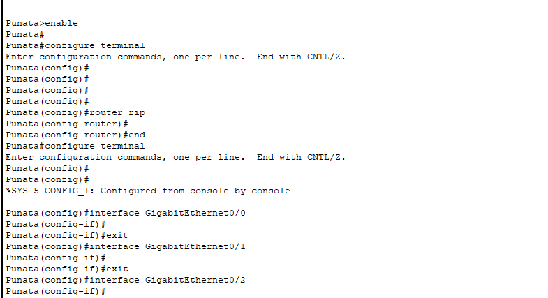
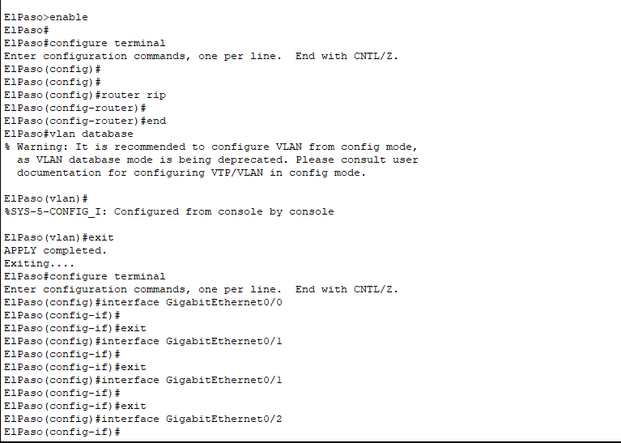

# Evaluacion cisco packet tracer

## Dispositivos y conecciones

Routers:
- Tarata
- Punata
- ElPaso
- Arani
- Cliza

Switches:
- Switch01
- Switch02
- Switch03

Pcs:
- PC01
- PC02
- PC03
- PC04

## Direccionamiento IP

**Configuraciones**

~~~sql
enable
configure terminal
~~~

~~~sql
interface GigabitEthernet0/0
ip address 200.30.40.X 255.255.255.0
no shutdown
exit
~~~

~~~sql
interface GigabitEthernet0/1
ip address 200.30.40.Y 255.255.255.0
no shutdown
exit
~~~

~~~sql
ip route 200.30.40.0 255.255.255.0 200.30.40.Z
~~~

~~~sql
ip route 200.30.40.0 255.255.255.0 200.30.40.Z
~~~
